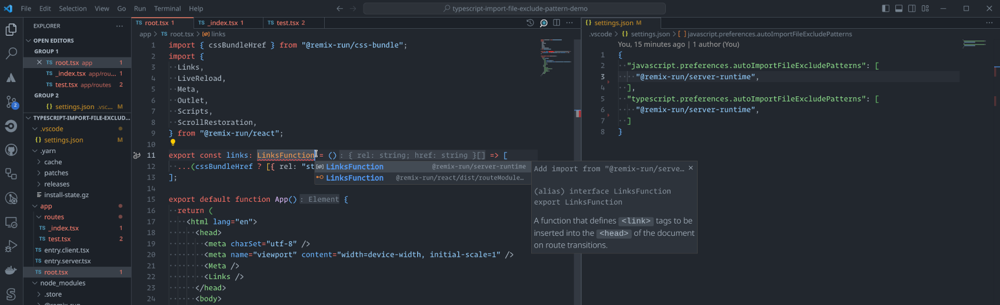
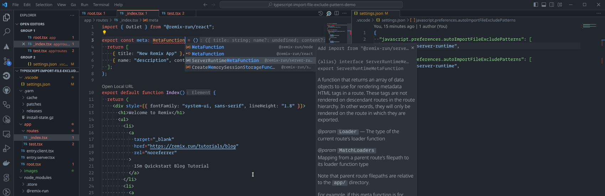
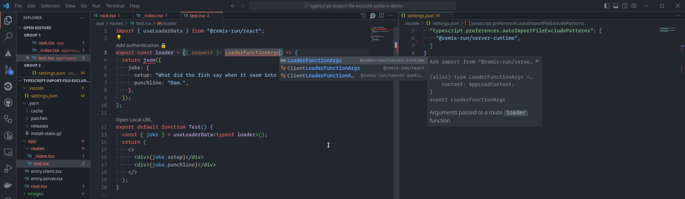

# Example repository for duplicating [typescript issue 55111](https://github.com/microsoft/TypeScript/issues/55111)

## Workspace VSCode settings

```json
{
  "javascript.preferences.autoImportFileExcludePatterns": [
    "@remix-run/server-runtime"
  ],
  "typescript.preferences.autoImportFileExcludePatterns": [
    "@remix-run/server-runtime"
  ]
}
```

## What is the issue

The `typescript.preferences.autoImportFileExcludePatterns` preference is not properly applying, with suggestions being made to import multiple types from the `@remix-run/server-runtime` library despite that library being explicitly listed as one to exclude from auto-import suggestions.

## How to reproduce the issue

1. `yarn install`
2. Open file `app/root.tsx`
3. Use CTRL-SPACE to show suggestions to fix the `LinksFunction` import. Note that VSCode suggests importing from `@remix-run/server-runtime` which was supposed to have been banned by the `typescript.preferences.autoImportFileExcludePatterns` option in the workspace. It should instead be offering `@remix-run/node`.
   
4. Open file `app/routes/_index.tsx`
5. Use CTRL-SPACE to show suggestions to fix the `MetaFunction` import. Note that VSCode suggests a possible import for `ServerRuntimeMetaFunction` from `@remix-run/server-runtime`. This suggestion should have been blocked by the `typescript.preferences.autoImportFileExcludePatterns` option in the workspace.
   
6. Open file `app/routes/test.tsx`
7. Use CTRL-SPACE to show suggestions to fix the `LoaderFunctionArgs` import. Note that VSCode again suggests importing it from `@remix-run/server-runtime` instead of presenting the desired import from `@remix-run/node`. The provided suggestion was supposed to have been banned by the `typescript.preferences.autoImportFileExcludePatterns` option in the workspace.
   

If I have misunderstood how to actually use the `typescript.preferences.autoImportFileExcludePatterns` option, please let me know how to fix the definitions currently within `.vscode/settings.json`.
